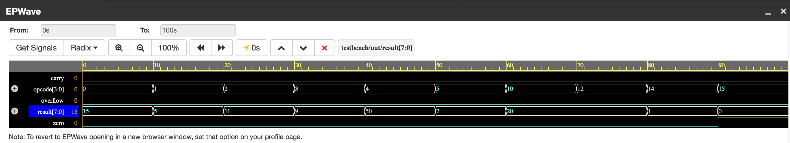

#  8-bit ALU in Verilog

##  Overview
This project implements an 8-bit Arithmetic Logic Unit (ALU) using Verilog.  
It performs a variety of arithmetic, logical, shift, and comparison operations based on opcode input.

---

##  Features

### Arithmetic Operations
- ADD
- SUB
- INC
- DEC
- MUL
- DIV

### Logical Operations
- AND
- OR
- XOR
- NOT

### Bit Manipulation
- Left Shift
- Right Shift
- Rotate Left
- Rotate Right

### Comparison
- A > B
- A == B

---

##  Flags
- Carry Flag
- Overflow Flag
- Zero Flag

---

##  Simulation
The design was tested using a Verilog testbench and verified using waveform analysis.

## 📊 Output Waveform

---

##  Tools Used
- Verilog
- EDA Playground
- EPWave

---

## Project Structure
design.v // ALU design
testbench.v // Testbench
waveform.png // Simulation output

___

##  Author
Mehreen Dhillon
